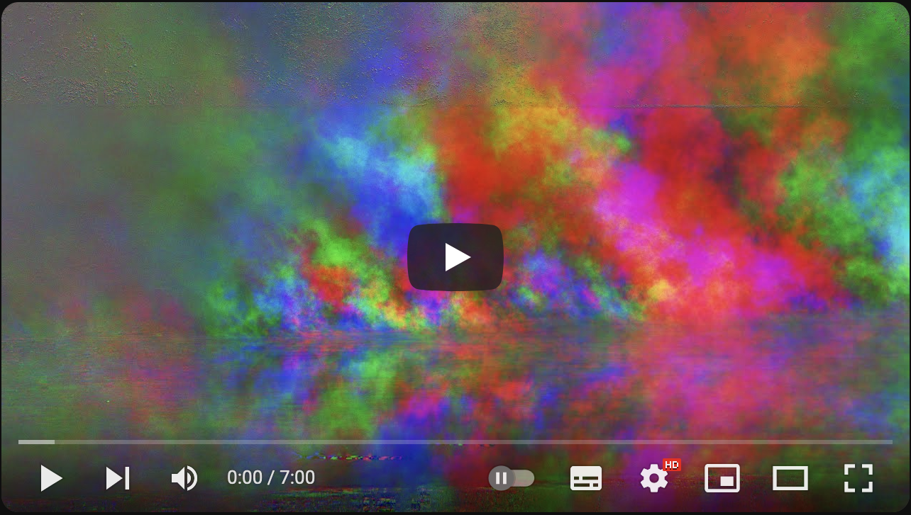

# Motion Extraction as per Posy

This program helps experiment with
[Posy's motion extraction method](https://www.youtube.com/watch?v=NSS6yAMZF78).
Posy proposed a simple algorithm to extract motion from a video. He shows off
some pretty trippy results. If you would like to try this for yourself and don't
have all the video processing programs that Posy uses, here is a version that
you can run in Python.

## Running

The code runs on Python 3, using Numy and OpenCV as dependencies. You will need
a video that you want to experiment with.

```sh
$ pip3 install python-opencv numpy
$ python3 posy-motion-extraction.py some-video.mp4
```

Substitute `some-video.mp4` with the file name of the video you would like to
work on.

The slider along the top of the main window allows you to control the time shift
(in frames) of the motion extraction.

Press `q` to exit the program.

## Background

This is a quick implementation of video motion extraction, using the method
proposed by [Posy](https://www.youtube.com/@PosyMusic) in his video on Motion
Extraction.

[](https://www.youtube.com/watch?v=NSS6yAMZF78)

It was actually [Steve Mould](https://www.youtube.com/@SteveMould) who got me
interested in
[video motion amplification](https://www.youtube.com/watch?v=rEoc0YoALt0), but I
never got round to anything like experimental implementation. The math behind
[Eulerian Video Magnification](https://people.csail.mit.edu/mrub/evm/) was
always a bit daunting. When I ran into Posy's video, making this proof of
concept was quick and easy.

Just to be clear: the code in this repository does _not_ implement Eulerian,
only the simplified version that Posy proposes.

Hope this helps.

